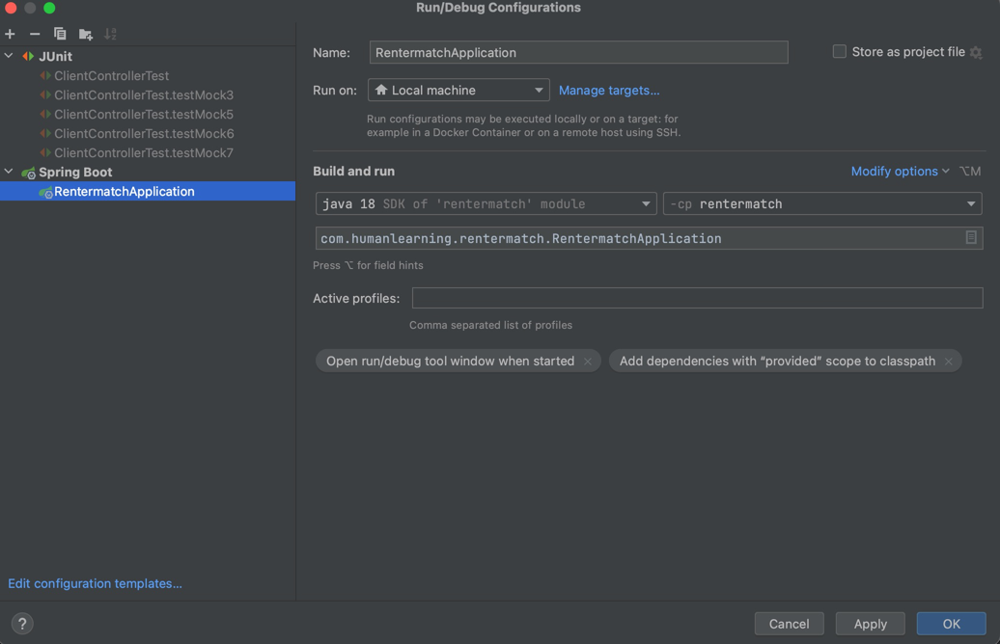
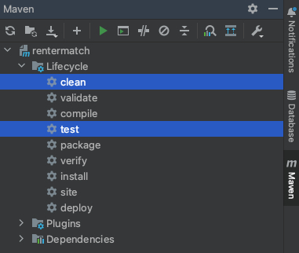

# 4156-Project

## How to use

* Platform: IntelliJ IDEA MacOS
* Framework: Springboot
* Versions: JDK 18, Maven 4.0.0

## How To Build, Run and Test

To build this project, run

```bash
$ mvn package
```

To run this project, see configuration as below, use IntelliJ internal running tool to run
RentermatchApplication.java.


To test this project, use IntelliJ internal running tool to run ClientControllerTest.java.

## API Introduction

For iteration2, we have the following endpoints:


## Code Style Checker

In this project, we are using Checkstyle Google Java Style. The xml file can be found:
https://github.com/checkstyle/checkstyle/blob/master/src/main/resources/google_checks.xml

Also, we apply intellij-java-google-style plugin, the file can be found:
https://github.com/google/styleguide/blob/gh-pages/intellij-java-google-style.xml

This is an example after code stylechecker scanning:


## Branch Coverage tool

In this project, we are using JaCoCo as the branch coverage tool.

We used Maven to add JaCoCo Plugin. Relevant information can be found:
https://www.jacoco.org/jacoco/

When checking code coverage with JaCoCo, select 'clean' and 'test' in the maven sidebar and click '
Run'.



Then use the browser to open 'index.html' in the target/site/jacoco folder to view the current code
coverage situation.


## Static Bug Finder

We are using SonarCloud as static bug finder, which will run automatically during CI. The report can
be found in

```
https://sonarcloud.io/summary/overall?id=Shuyuw1004_4156-Project
```

## Heroku Deploy

```
https://rentermatch-service.herokuapp.com/ 
```


