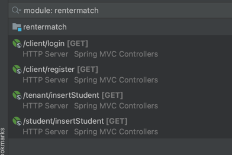
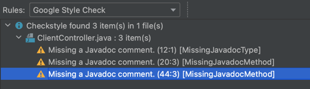
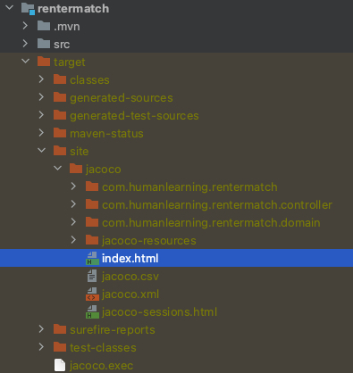

# 4156-Project

## How to use

* Platform: IntelliJ IDEA MacOS
* Framework: Springboot
* Versions: JDK 18, Maven 4.0.0


## How To Build, Run and Test

To build this project, run

```bash
$ mvn package
```

To run this project, see configuration as below, use IntelliJ internal running tool to run RentermatchApplication.java.


To test this project, use IntelliJ internal running tool to run ClientControllerTest.java.


## API Introduction
For iteration1, we have the following endpoints:



* GET /client/login
  - Description: This is for our client to sign in our service.
  - Request parameters: email, password. Both cannot be empty.
  - Response Body: email, password
* GET /client/register
  - Description： This is for our client to register for our service. 
  - Request parameters: email, name, password. All of them cannot be empty.
  - Response Body:
    - 1: register successfully
    - 0: register failed.
* /tenant/insertStudent
  - Description: This is for our client tenant to insert Student.
  - Request parameters: Attributes as in the database. Among all of them, tid cannot be empty.
  - Response Body:
    - 1: insert successfully
    - 0: insert failed.
* /student/insertStudent
  - Description: This is for our client student to insert information to create profile.
  - Request parameters: email, name, sid, uni tid. All of them cannot be empty.
  - Response Body:
    - 1: insert successfully
    - 0: insert failed.

  
## Code Style Checker
In this project, we are using Checkstyle Google Java Style. The xml file can be found: 
https://github.com/checkstyle/checkstyle/blob/master/src/main/resources/google_checks.xml

Also, we apply intellij-java-google-style plugin, the file can be found:
https://github.com/google/styleguide/blob/gh-pages/intellij-java-google-style.xml

This is an example after code stylechecker scanning:




## Branch Coverage tool
In this project, we are using JaCoCo as the branch coverage tool.

We used Maven to add JaCoCo Plugin. Relevant information can be found:
https://www.jacoco.org/jacoco/

When checking code coverage with JaCoCo, select 'clean' and 'test' in the maven sidebar and click 'Run'.


Then use the browser to open 'index.html' in the target/site/jacoco folder to view the current code coverage situation.



## Static Bug Finder 
We are using SonarCloud as static bug finder, which will run automatically during CI. The report can be found in
```
https://sonarcloud.io/summary/overall?id=Shuyuw1004_4156-Project
```
